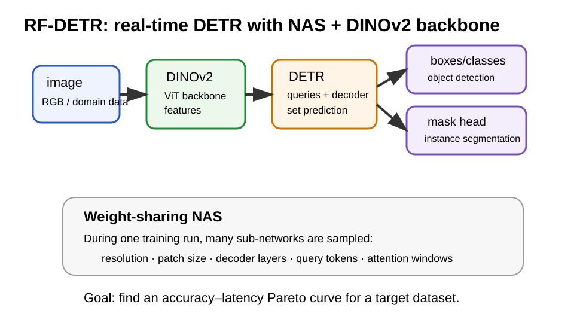

# 08. RF-DETR — 실시간 DETR 객체 탐지와 인스턴스 세그멘테이션

## 1. 한 줄 요약

**RF-DETR**은 DINOv2 backbone과 DETR 방식의 query-based detector를 사용하고, weight-sharing NAS로 속도와 정확도의 균형점을 찾는 실시간 객체 탐지 / 인스턴스 세그멘테이션 모델이다.

## 2. 먼저 DETR가 뭐야?

DETR는 **Detection Transformer**의 줄임말이다. 기존 YOLO 계열처럼 촘촘한 grid/anchor에서 박스를 많이 찍는 방식과 다르게, DETR는 “몇 개의 object query”가 이미지 안의 물체들을 하나씩 담당하도록 학습한다.

아주 쉽게 말하면:

- CNN/ViT backbone이 이미지를 feature로 바꾼다.
- object query들이 “내가 찾을 물체가 있나?”를 물어본다.
- 각 query가 class와 bounding box를 출력한다.
- 필요하면 mask도 출력한다.

## 3. RF-DETR 그림

**그림 1.** RF-DETR은 DINOv2 feature, DETR query/decoder, detection head, segmentation head를 결합하고, NAS로 여러 inference configuration을 찾는다.

## 4. 핵심 수식 1 — query set prediction

DETR류 detector는 여러 query가 예측 집합을 만든다.

$$
\hat{Y}=\{(\hat{c}_i,\hat{b}_i)\}_{i=1}^{N}
$$

여기서:

| 기호 | 뜻 |
|---|---|
| $N$ | object query 개수 |
| $\hat{c}_i$ | i번째 query가 예측한 class |
| $\hat{b}_i$ | i번째 query가 예측한 bounding box |
| $\hat{Y}$ | 전체 예측 object set |

이 방식의 핵심은 “순서 없는 물체 집합”을 예측한다는 점이다. 이미지 안의 물체에는 1번 물체, 2번 물체 같은 고정 순서가 없기 때문이다.

## 5. 핵심 수식 2 — matching

정답 object set을 $Y$라고 하고, 예측 set을 $\hat{Y}$라고 하자. DETR는 Hungarian matching으로 정답과 예측을 가장 잘 짝지은 뒤 loss를 계산한다.

$$
\sigma^* = \arg\min_{\sigma}\sum_i \mathcal{C}(y_i,\hat{y}_{\sigma(i)})
$$

이 수식은 “정답 i번과 어떤 예측을 연결해야 전체 비용이 가장 작아지는가?”를 찾는다는 뜻이다.

## 6. RF-DETR의 핵심 아이디어

RF-DETR의 핵심은 단순히 “DETR 하나 만들었다”가 아니다. 중요한 점은 다음 세 가지다.

| 아이디어 | 쉬운 설명 |
|---|---|
| DINOv2 backbone | 좋은 self-supervised visual feature에서 시작한다 |
| DETR query detector | query들이 물체 후보를 직접 예측한다 |
| weight-sharing NAS | 한 번의 학습으로 여러 속도/정확도 모델을 탐색한다 |

## 7. NAS가 뭐야?

NAS는 **Neural Architecture Search**의 줄임말이다. 모델 구조를 사람이 하나하나 고르는 대신, 여러 구조 후보를 탐색해서 좋은 구조를 찾는 방법이다.

RF-DETR에서는 다음 knob들을 바꿔 본다.

| knob | 바꾸면 생기는 일 |
|---|---|
| image resolution | 커지면 작은 물체를 잘 보지만 느려진다 |
| patch size | 작아지면 세밀하지만 계산량이 커진다 |
| decoder layers | 많으면 정교하지만 느려진다 |
| query tokens | 많으면 많은 물체를 잡지만 계산량이 늘어난다 |
| attention windows | attention 범위와 속도를 조절한다 |

## 8. weight-sharing NAS가 왜 좋은가?

일반적으로 후보 모델을 1000개 만들고 각각 학습하면 너무 비싸다. RF-DETR는 하나의 super-network 안에서 여러 sub-network를 공유해서 학습한다.

아주 쉽게 말하면:

> 큰 공용 모델 하나를 학습하면서, 그 안에서 작은 모델/큰 모델/빠른 모델/정확한 모델을 함께 연습시키는 방식이다.

그래서 target dataset에 대해 속도와 정확도의 Pareto curve를 찾는다.

## 9. Pareto curve가 뭐야?

속도와 정확도는 보통 trade-off 관계다.

- 빠른 모델은 정확도가 낮을 수 있다.
- 정확한 모델은 느릴 수 있다.

Pareto optimal model은 “이 속도에서 이보다 더 정확한 모델을 찾기 어렵다” 또는 “이 정확도에서 이보다 더 빠른 모델을 찾기 어렵다”는 점이다.

## 10. RF-DETR-Seg — segmentation head

RF-DETR는 instance segmentation head도 제공한다. 이 head는 pixel embedding map과 query embedding을 결합해서 mask를 만든다.

간단히 쓰면:

$$
M_i(u,v)=\mathbf{q}_i^T\mathbf{p}(u,v)
$$

여기서:

| 기호 | 뜻 |
|---|---|
| $M_i(u,v)$ | i번째 object query의 pixel 위치 (u,v) mask score |
| $\mathbf{q}_i$ | i번째 query embedding |
| $\mathbf{p}(u,v)$ | pixel 위치 (u,v)의 embedding |

쉽게 말하면 query embedding과 pixel embedding이 잘 맞으면 그 pixel은 해당 object의 mask에 포함된다.

## 11. Semantic segmentation과는 뭐가 달라?

이 부분이 중요하다. RF-DETR-Seg는 기본적으로 **instance segmentation**에 가깝다.

| 종류 | 질문 | 출력 |
|---|---|---|
| object detection | 물체가 어디에 있나? | bounding boxes |
| instance segmentation | 각 물체 instance의 모양은? | object별 masks |
| semantic segmentation | 모든 pixel의 class는? | pixel-wise class map |

따라서 RF-DETR를 semantic segmentation 논문에 넣을 때는 “직접 semantic segmentation 모델”이라기보다 **detection / instance segmentation head / real-time transformer baseline**으로 정리하는 것이 맞다.

## 12. 논문에서 보고한 주요 claim

검증한 출처 기준:

- arXiv abstract는 RF-DETR nano가 COCO 48.0 AP를 달성하고 D-FINE nano보다 비슷한 latency에서 5.3 AP 높다고 보고한다.
- RF-DETR 2x-large는 RF100-VL에서 GroundingDINO tiny보다 1.2 AP 높고 20배 빠르다고 보고한다.
- 저자들은 RF-DETR 2x-large가 COCO 60 AP를 넘는 첫 real-time detector라고 주장한다.
- GitHub README는 RF-DETR가 object detection, instance segmentation, keypoint detection preview를 지원한다고 설명한다.

## 13. MultimodalSeg와 연결

[[26_touchNplug/00_MOC_26_touchNplug|touchNplug]]의 study 자료지만, 이 내용은 [[../../26_MultimodalSeg/00_MOC_26_MultimodalSeg|26_MultimodalSeg]]와도 연결된다.

멀티모달 semantic segmentation 연구에서 RF-DETR는 다음 위치에 둘 수 있다.

| 관점 | RF-DETR의 역할 |
|---|---|
| object detection baseline | YOLO, RT-DETR, D-FINE, GroundingDINO와 비교 |
| instance mask head | query 기반 mask prediction 참고 |
| foundation backbone adaptation | DINOv2 backbone + task head 구조 참고 |
| real-time constraint | accuracy-latency Pareto curve 사고방식 참고 |

## 14. 주의점

- RF-DETR는 RGB 기반 detection/instance segmentation 중심이다.
- 논문 자체가 RGB-thermal, RGB-depth, LiDAR-camera multimodal segmentation을 해결한 것은 아니다.
- instance segmentation과 semantic segmentation은 다르다.
- benchmark 수치는 최종 camera-ready와 repository 기준이 달라질 수 있으므로 논문에 넣을 때 출처를 명확히 해야 한다.

## 15. 기억법

| 질문 | 답 |
|---|---|
| RF-DETR는 뭐야? | 실시간 DETR detector + NAS |
| backbone은? | DINOv2 |
| segmentation도 해? | instance segmentation head를 제공한다 |
| semantic segmentation 모델이야? | 직접 semantic segmentation 모델은 아니다 |
| 왜 중요해? | foundation feature + real-time DETR + Pareto search 조합 |

## 16. 참고문헌

- Robinson, I., Robicheaux, P., Popov, M., Ramanan, D., & Peri, N. (2025). *RF-DETR: Neural Architecture Search for Real-Time Detection Transformers*. arXiv:2511.09554.
- Carion, N. et al. (2020). *End-to-End Object Detection with Transformers*.
- Oquab, M. et al. (2023). *DINOv2: Learning Robust Visual Features without Supervision*.
- Li, F. et al. (2023). *Mask DINO*.
