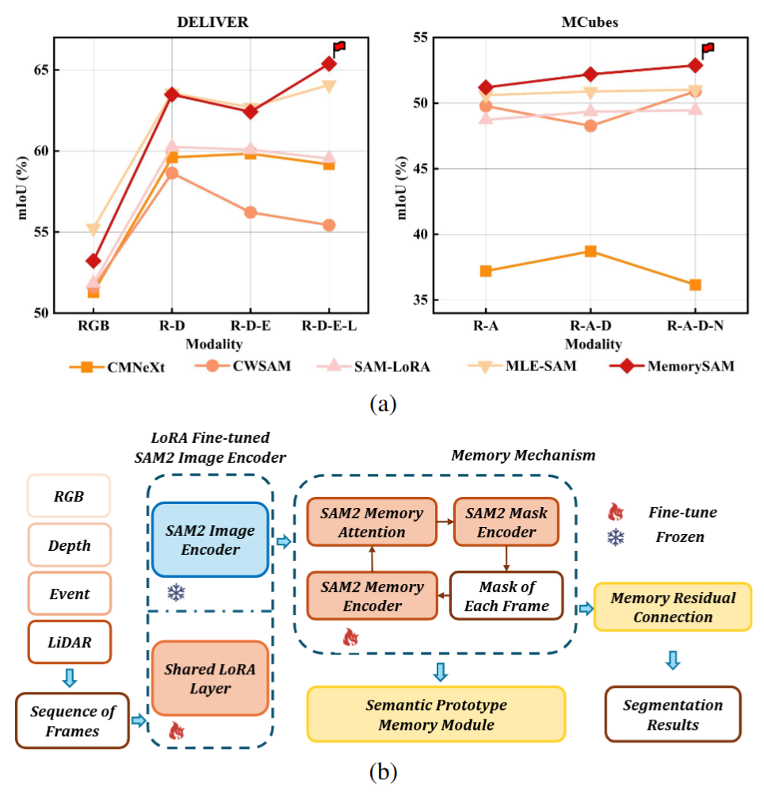
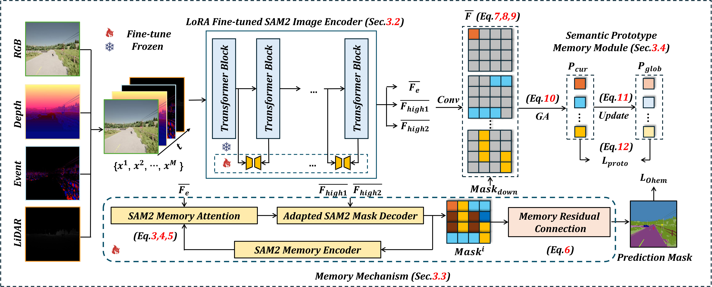

# <p align="center"><strong>MemorySAM: Memorize Modalities and Semantics with Segment Anything Model 2 for Multi-modal Semantic Segmentation</strong></p>

<div align="center">
Chenfei Liao<sup>1</sup>, Xu Zheng<sup>1,2</sup><sup></sup> (Project lead), Yuanhuiyi Lyu<sup>1</sup>, Haiwei Xue<sup>5</sup>, Yihong Cao<sup>4</sup>, 
    
Jiawen Wang<sup>6</sup>, Kailun Yang<sup>4</sup>, Xuming Hu<sup>1,3</sup><sup></sup> (Corresponding author)
</div>

<div align="center">
<sup>1</sup>HKUST(GZ), <sup>2</sup>INSAIT, <sup>3</sup>HKUST, <sup>4</sup>HNU, <sup>5</sup>THU, <sup>6</sup>CUMTB
</div>

<div align="center">
    
[](https://arxiv.org/abs/2503.06700)

</div>

## Abstract

Research has focused on Multi-Modal Semantic Segmentation (MMSS), where pixel-wise predictions are derived from multiple visual modalities captured by diverse sensors. Recently, the large vision model, Segment Anything Model 2 (SAM2), has shown strong zero-shot segmentation performance on both images and videos. When extending SAM2 to MMSS, two issues arise: 

🔥1. How can SAM2 be adapted to multi-modal data?

🔥2. How can SAM2 better understand semantics?

Inspired by cross-frame correlation in videos, we propose to treat multi-modal data as a sequence of frames representing the same scene. Our key idea is to **"memorize"** the modality-agnostic information and **"memorize"** the semantics related to the targeted scene. To achieve this, we apply SAM2’s memory mechanisms across multi-modal data to capture modality-agnostic features. Meanwhile, to memorize the semantic knowledge, we propose a training-only Semantic Prototype Memory Module (SPMM) to store category-level prototypes across training for facilitating SAM2’s transition from instance to semantic segmentation. A prototypical adaptation loss is imposed between global and local prototypes iteratively to align and refine SAM2's semantic understanding. 
Extensive experimental results demonstrate that our proposed MemorySAM outperforms SoTA methods by large margins on both synthetic and real-world benchmarks (65.38% on DELIVER, 52.88% on MCubeS). 
<div align="center">
    
</div>

## News
⭐ If you find any problems in our code, please contact us! We will fix them as soon as possible! 

📧 lcfgreat624@gmail.com, cliao127@connect.hkust-gz.edu.cn

🚩 2025/3/10 Our paper has been online on Arxiv: https://arxiv.org/pdf/2503.06700

🚩 2025/3/13 We release the first version of our souce code! The weight will be released soon~

## Framework

<div align="center">
    
</div>

## Code Structure Illustration

About the entire model part, we use the same code as standard SAM2, which is in  "MemorySAM/semseg/models/sam2". We clone these files from SAM's official code at the beginning of our project. The MemorySAM model code is mainly in "MemorySAM/semseg/models/sam2/sam2/sam_lora_image_encoder_seg.py", with the model named as LoRA_Sam. Finally, in "train_sam2_lora.py", we import this model and train.

## Preparation

### Environment Setup

1. Create a new Conda environment and activate it:
    ```bash
    conda create -n MMSS_SAM python=3.10 
    conda activate MMSS_SAM
    ```

2. Download SAM2's weight and upload it into the `semseg/models/sam2/checkpoints` directory. [Facebook Research SAM2 Repository](https://github.com/facebookresearch/sam2)

2. Install PyTorch and related libraries:
    ```bash
    pip install torch==2.3.1 torchvision==0.18.1 torchaudio==2.3.1 --index-url https://download.pytorch.org/whl/cu121
    ```

3. Install additional dependencies:
    ```bash
    pip install -r requirements.txt
    ```

4. Navigate to the model directory and install:
    ```bash
    cd semseg/models/sam2
    pip install -e .
    ```

---

## Run

### Data Preparation

1. Download the DELIVER/MCubes dataset and place it into the `data/` directory.

### Running the Model

2. Execute the following command to start the model:
    ```bash
    sh run_sam.sh
    ```
## Acknowledgements

🤝 Our work is based on project of [DELIVER](https://github.com/jamycheung/DELIVER) and [SAM2](https://github.com/facebookresearch/sam2). Thanks to their contributions to this community!!!

🤝 Also, thanks to [DELIVER](https://github.com/jamycheung/DELIVER) and [MCubes](https://github.com/kyotovision-public/multimodal-material-segmentation) for their efforts to build such valuable datasets!!!

🤝 Moreover, thanks to [Xu Zheng](https://github.com/zhengxuJosh) (zhengxu128@gmail.com) for his great guidance and help for this project, who is the lead of this project!!!

## References

If you find this project helpful, please consider citing the following paper:
```
@misc{liao2025memorysammemorizemodalitiessemantics,
      title={MemorySAM: Memorize Modalities and Semantics with Segment Anything Model 2 for Multi-modal Semantic Segmentation}, 
      author={Chenfei Liao and Xu Zheng and Yuanhuiyi Lyu and Haiwei Xue and Yihong Cao and Jiawen Wang and Kailun Yang and Xuming Hu},
      year={2025},
      eprint={2503.06700},
      archivePrefix={arXiv},
      primaryClass={cs.CV},
      url={https://arxiv.org/abs/2503.06700}, 
}
```

Thank you for your interest and support!
